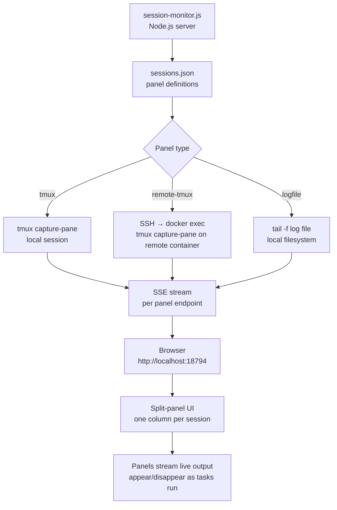
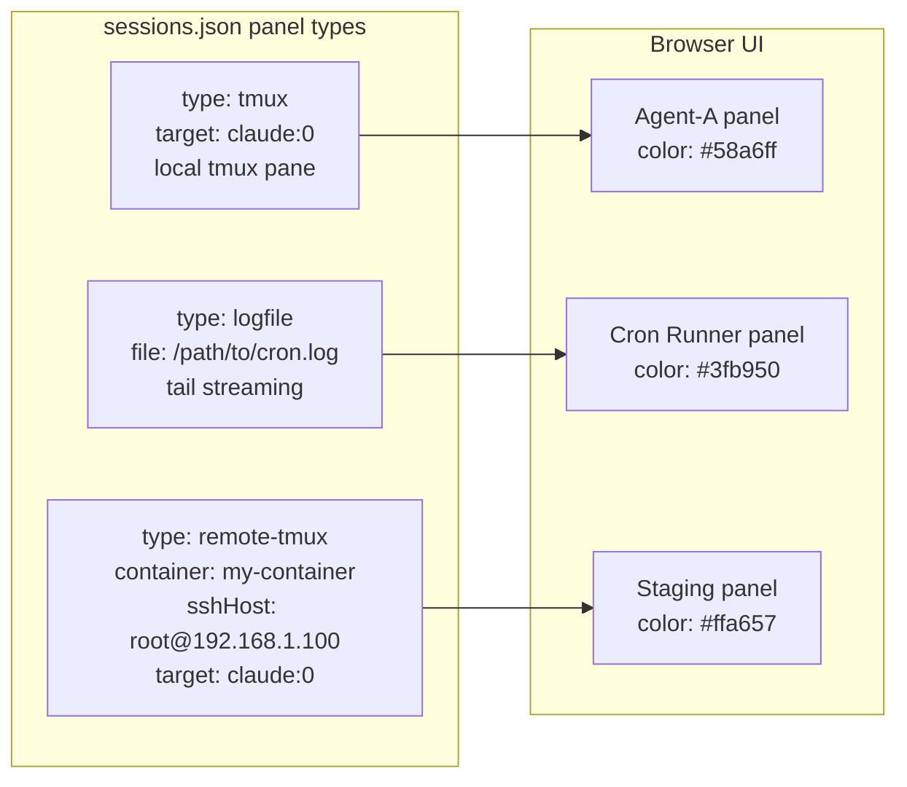

# claude-code-session-monitor

Real-time web UI for monitoring multiple Claude Code sessions side-by-side. Split-panel terminal view that streams tmux panes and log files to the browser via SSE. Parallel task panels appear and disappear automatically as tasks run.

> Part of [The Agent Crafting Table](https://github.com/Agent-Crafting-Table) — standalone Claude Code agent components.

## How It Works





## Drop-in

```bash
# Copy to your agent workspace
cp monitor.js          /your/workspace/scripts/session-monitor.js
cp sessions.example.json /your/workspace/sessions.json

# Edit sessions.json for your setup, then run:
node scripts/session-monitor.js
# Open http://localhost:18794
```

## Configuration

`sessions.json` is an array of panel definitions:

```json
[
  {
    "id": "agent-a",
    "label": "⚡ Agent-A",
    "color": "#58a6ff",
    "type": "tmux",
    "target": "claude:0",
    "termUrl": "http://localhost:7681"
  },
  {
    "id": "cron",
    "label": "⏰ Cron Runner",
    "color": "#3fb950",
    "type": "logfile",
    "file": "/path/to/cron.log"
  },
  {
    "id": "staging",
    "label": "🔬 Staging",
    "color": "#ffa657",
    "type": "remote-tmux",
    "container": "my-staging-container",
    "target": "claude:0",
    "sshHost": "root@192.168.1.100",
    "sshKey": "~/.ssh/id_rsa"
  }
]
```

### Session types

| Type | Description | Required fields |
|------|-------------|-----------------|
| `tmux` | Local tmux pane | `target` (`session:window`) |
| `remote-tmux` | tmux in a Docker container via SSH | `container`, `target`, `sshHost`, optionally `sshKey` |
| `logfile` | Tail a local log file | `file` (absolute path) |

## Requirements

- Node.js 16+
- Zero runtime dependencies
- `tmux` for local/remote session panels
